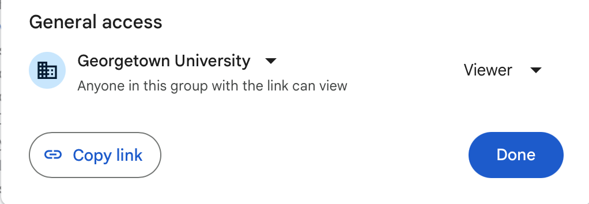
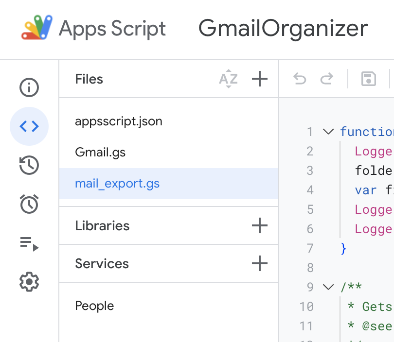
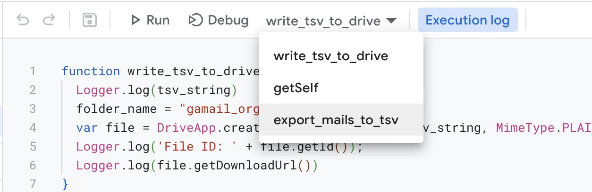
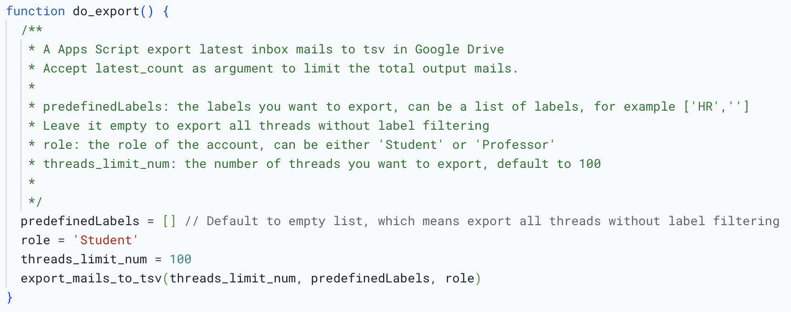
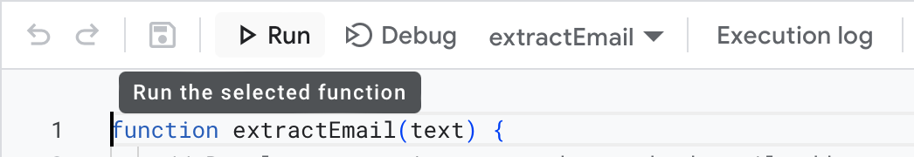
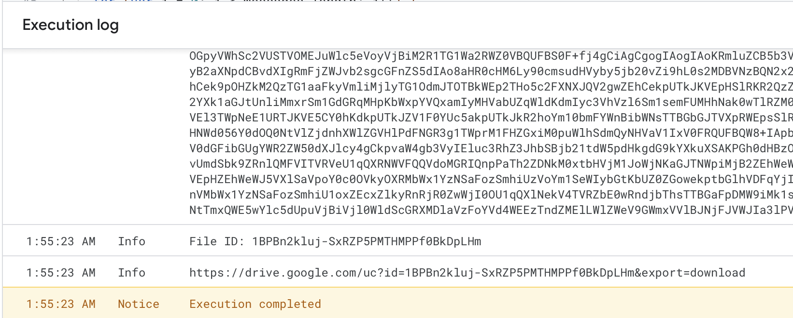

# Mail Organizer

a mail organizer by auto labeling your emails specially designed for DSAN program students and professors.

## Teams

Jacky Zhang, Josh Zhu, Charlie Han, Lianghui Yi

## Product User Stories

- Single Installation: The product should be accessible with a one-time installation as either a browser extension or a Google apps extension. No further complicated setup should be required.

- Universal Benefit: The tool is designed to cater to the needs of both professors and students, enhancing their email management experience.

- Role Recognition: Implement automatic user role detection to personalize the experience without requiring manual user settings.

- Predefined Labels: Offer predefined labels upon installation tailored to the roles of students and professors and existing email data.

- Automatical Labeling: Labelling existing emails automatically upon first run and new emails as they arrive.

- (Deferred) Labels Extraction: Extract labels from existing emails to expand the predefined label pool.

- (Deferred) Custom Labels: Allow users to create their own labels which the system will automatically utilize in classifying emails.

- (Deferred) Label Expansion: Leverage GPT technology to expand existing labels to a bunch of representations, enhancing the system’s ability to classify emails effectively also provide privacy protection without sending any email content to GPT.

## Milestones

1. 11/18 Product Target Confirmation: Define the specific goals and functionalities of the product.
2. 11/20 Mail Data Acquisition: Secure a dataset of emails for training and testing the classification algorithms.
3. 11/24 Software Development: Code the first version of the software.
4. 11/25 Testing Phase: Test the software for bugs, user experience, and performance.  
5. 11/28 Presentation Preparation: Finalize the presentation slides for the project. 
6. 11/30 Presentation Date: Set a date for the project presentation. 
7. 12/05 Final Delivery: Establish a deadline for the final software deliverable. 
8. 12/05 Future Planning: Outline steps for future improvements and features.

## Team Arrangements

- Gmail Integration: Develop and test the integration with Gmail.
  - Verky
- Data Collection and Labeling: Collect and clean the dataset for training and testing the classification algorithms.
  - Josh
- Project Skeleton: Create the project skeleton and organize the codebase.
  - Verky
- Role Classification: Create an algorithm to classify users as students or professors.
  - Jacky
- Predefined Label Pools and Account Label Matching: Assign labels to account based on role and history.
  - Charlie
- Core Labels Classifier: Create a classifier to assign labels to emails.
  - **See Predefined Labels**
- Testing: Test the software for bugs, user experience, and performance.
  - Maybe Jacky
- Presentation: Prepare the presentation slides for the project.
  - Maybe Charlie
- Advanced Features: Consider the implementation of topic modeling for the creation of non-predefined labels as a future enhancement.
  - TBD

***Note:*** *The team arrangement is subject to change as the project progresses. Team members can use `Issue` tools on Github to track or discuss detailed subtask.*

## Predefined Labels

- Course-Related Emails: Automatically categorize course-related communications into a designated folder. For example, DSAN 5000, DSAN 5100, etc.
  - Josh
- Campus Events: Aggregate emails related to campus events into a separate folder for easy access.
  - Jacky
- HR: For professor and students with on-campus jobs, the system will automatically categorize HR-related emails into this label.
  - Charlie
- Zoom/Appointments: The system will automatically categorize emails related to Zoom meetings and appointments into this label.
  - Verky
- Co-faculty: The system will automatically categorize emails from co-workers into this label, which is only available for professors.
  - TBD
- NewsLetter: The system will automatically categorize emails from newsletters into this label.
  - TBD
- Professor: The system will automatically categorize emails from professors into this label. This label is only available for students.
  - TBD
- Current Students: The system will automatically categorize emails from current students into this label. This label is only available for professors.
  - TBD
- Prospective Students: The system will automatically categorize emails from prospective students into this label. This label is only available for professors.
  - TBD

## Tech Implementation

This software mainly consists of three parts: Gmail integration, role classification, and labeling system.

- Google Apps Script(Javascript): The system will be implemented as a Google Apps Script to integrate with Gmail.
- Mail Classification Service(Python): The system will utilize a classification service to classify emails into predefined labels. The service will be implemented in Python. 
- Role Classification Model(Python): The system will utilize a machine learning model to classify users as students or professors. The model will be implemented in Python.
- Database: The system will utilize a database to store the result of the role classification model. We might use the feature of Google Apps Script to store the result in the cache.
  - Properties Service: https://developers.google.com/apps-script/reference/properties/properties-service
    (Maximum cache retention time is 6 months)

*Note: To avoid using labels already used by users, we will prefix all auto-generated labels with `Auto-`. For example, `Auto-DSAN 5000`. Also by doing this, we only need to store the role within property service.*

Workflow:

1. The system will be deployed as a Google Apps Script.
2. The system will be triggered periodically to label new emails.
3. During each run, the system will first classify users as students or professors by the role classification model and assign corresponding labels to their accounts. To save future computation, the system will cache the result in the database. We might use the feature of Google Apps Script to store the result in the cache.
4. The system will then classify emails into predefined labels by the classification service. The service will utilize the cached result to classify emails. During the process, besides the mail itself, the script will also pass predefined labels and account role labels to the service. The service will utilize the predefined labels and account labels to classify emails. Also to avoid repeated classification on the same mail, the system will cache the current runtime timestamp and the mail id in the database. The service will check the cache before classifying the mail.
5. The system will then add labels to the mail.


### Deployment and How to Use

In our first version of the software, we will deploy the system as a Google Apps Script. 

**Frontend**

#### Possible Solution: Shared Script

We will share the script to all users within the Georgetown domain. Now users within this domain can copy the script to their own Google Drive and setup a trigger to run the script periodically.
Since the execution of the script needs some computing resources, we need to confirm the whole proces.

**As to demo as soon as possible, we will use this solution during our presentation.**

Complexity: Low



#### Possible Solution: Internal Webapps

We will deploy the system as a webapp within the Georgetown domain. Now users within this domain can access the webapp and run the script to label their mail.

We need to implement the scheduling function to run the script periodically, which is included by Google Apps Script. We may reuse this feature from Google Apps Script, or else we have to implement it by ourselves.

Complexity: Medium

#### Possible Solution: Worskpace Add-on or Chrome Extension

We will deploy the system as a Workspace Add-on or Chrome Extension. Now users can install the add-on or extension and run the script to label their mail.

Complexity: High

**Backend**

For the python classification service, we will deploy it as a Google Cloud Function. The function will be triggered by the Google Apps Script.

To be efficient, we won't use any database to store the result of the classification service. Instead, we will use the feature of Google Apps Script to store the result in the cache.

And directly use the cache to add labels to the mail. 

## DataSet Format Sample

All exported mail should be stored as tsv file for better analysis.

### Export Script

Should provide a Apps Script to export all mail in a specific label to a tsv file.

Apps Script:

https://script.google.com/u/1/home/projects/1s55R9e9Qb6pLRTqyRH4oaDmMeM2mDYsRIfBmZk1gxq0HhS3Y4dJeDtmf

The above script is currently available for all users within the Georgetown domain. It will export all mail in the `Course` label to a tsv file.

You can find the exported filed download url in the log of the script.

#### Steps

1. Click the above apps script link.
2. On the left `Files` pannel, choose `mail_export.gs` file.
  
3. Close to the Debug button, click the `Select function` dropdown menu, choose `do_export`.
  
4. Before running the script, Change parameters in the `do_export` function according to your need.
  
4. Click the Run button to run the script.
  
5. Check the log of the script, you will find the download url of the exported file.
  


### Mail Format

|---|Account|From|To|Subject|Body|Label|Role|
|---|-------|----|--|-------|----|-----|----|
|1  |ly297@georgetown.edu|Verky Yi <ly297@georgetown.edu>| Charlie Han <charlie@georgetown.edu>|DSAN 5000|Hi, Charlie, I am Verky, a student in DSAN 5000. I am writing to ask about the final project. Can you give me some advice?|Course|Student|


### Import Script

Should provide a Python script to import the exported tsv file to the database.

Path: ./utils/data_loader.py

This file provide a utility function to import the exported tsv file to a Pandas DataFrame.

Since we encode the mail body in base64, the function will decode the body before return the DataFrame.

Example: 

```python
from utils.data_loader import get_mail_dataframe
# file_path is the path of the exported tsv file, you only need to include the file name and extension.
# default is to find that file within the data folder.
file_path = 'student_inbox_ly297.tsv'
mails = get_mail_dataframe(file_path)
```


### Service Account

#### App Engine default service account

cryptic-skyline-399006@appspot.gserviceaccount.com

#### Compute Engine default service account

615698571364-compute@developer.gserviceaccount.com